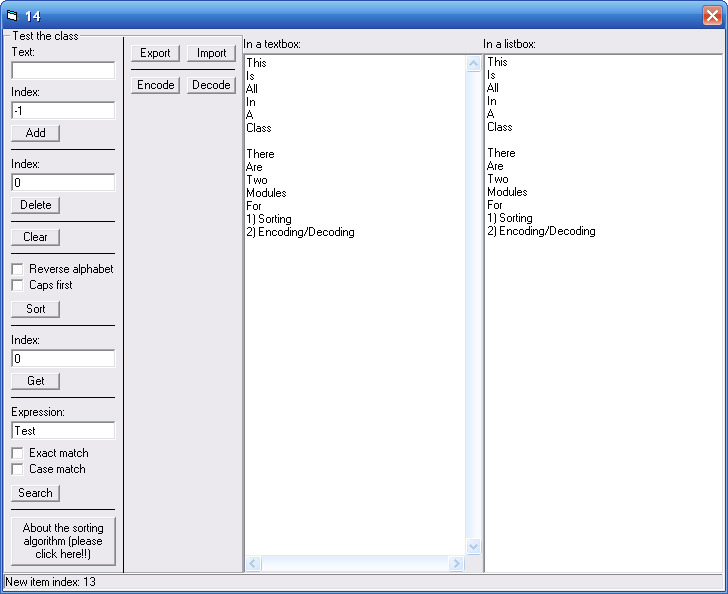



## Listbox Replacement Class V1\.2

### Description

I often find myself in need of a listbox in applications in which I don't use forms. I couldn't find anything on PSC (which would have saved me some time), so I just wrote my own. This is just a simple listbox class, no events, no confusing, never ending functions, just plain, simple VB code (I haven't used any APIs :D). The class is very small (only 2.3 kb). Also, this class can have more than 32767 items, because I've used Longs, and not Integers (like the VB listbox).

V1.2

New features (since V1.0):

--V1.1:

1) alphabetically sorting (module by Rde)

2) Add items somewhere in the middle of the list

3) Transport the list to a control (build-in textbox/listbox/combobox support)

4) Events

--V1.2:

5) Search

6) Import from and export to a file

7) Encryption/decryption*

*The encrypting/decrypting doesn't work very well. I'm not really an expert on encrypting/decrypting, so if anyone can (re-)write this for me... :D
 
### More Info
 

             |
---                |---
**Submitted On**   |2006-04-01 17:37:12
**By**             |[HardStream](https://github.com/Planet-Source-Code/PSCIndex/blob/master/ByAuthor/hardstream.md)
**Level**          |Beginner
**User Rating**    |5.0 (10 globes from 2 users)
**Compatibility**  |VB 3\.0, VB 4\.0 \(16\-bit\), VB 4\.0 \(32\-bit\), VB 5\.0, VB 6\.0, VBA MS Access, VBA MS Excel
**Category**       |[Custom Controls/ Forms/  Menus](https://github.com/Planet-Source-Code/PSCIndex/blob/master/ByCategory/custom-controls-forms-menus__1-4.md)
**World**          |[Visual Basic](https://github.com/Planet-Source-Code/PSCIndex/blob/master/ByWorld/visual-basic.md)
**Archive File**   |[Listbox\_Re198443412006\.zip](https://github.com/Planet-Source-Code/hardstream-listbox-replacement-class-v1-2__1-64823/archive/master.zip)

### API Declarations

Some, but the can be removed

